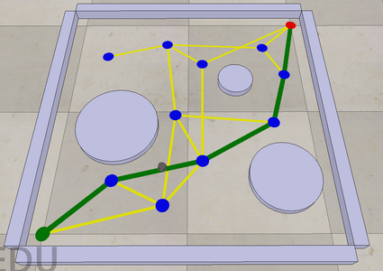

# A* Graph Search Project

Given the start node, and the goal node, your program will search the graph for a minimum-cost path from the start to the goal. Your program will either return a sequence of nodes for a minimum-cost path or indicate that no solution exists.

Obstacles are represented as cylinders. The path that the kilobot actually follows is indicate by green edges, and the goal node is in red.

This scene does not do motion planning. Omsyead, it displays the output of your motion planner. It expects you to provide the path to a folder with four files, called nodes.csv, edges.csv, path.csv, and obstacles.csv.

node.csv: Each row is of the form ID, x, y, heuristic-cost-to-go

edges.csv: if the graph has E edges, then this file has E rows. Each row is of the form ID1, ID2, cost.

obstacles.csv: Location and diameters of the circular obstacles.

